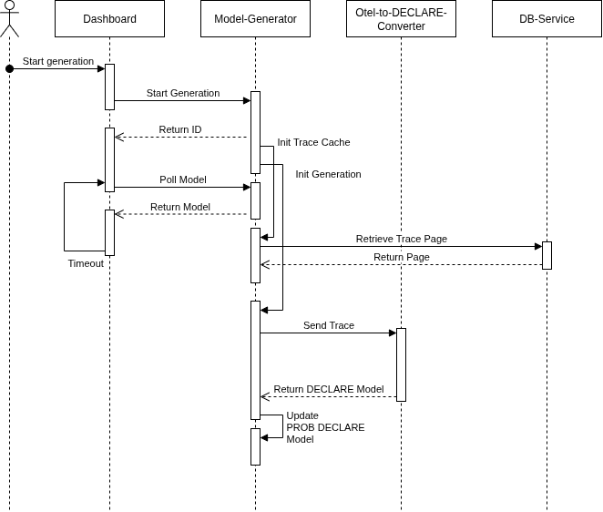
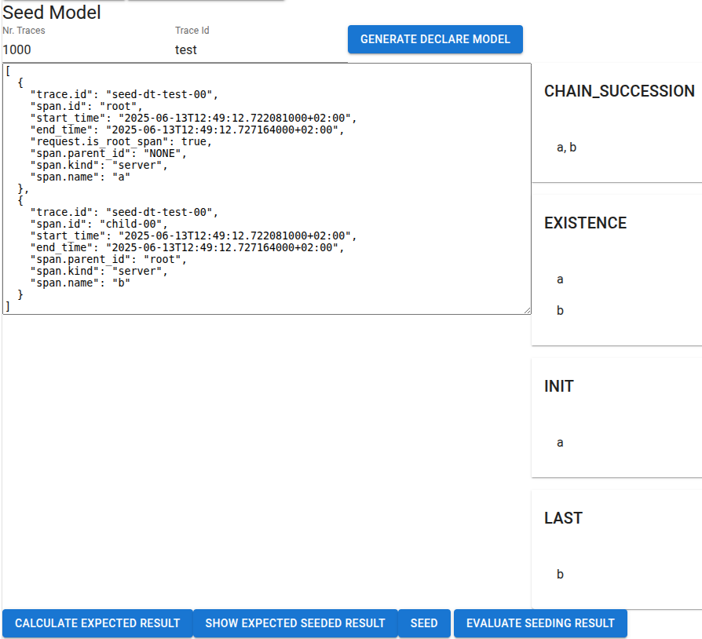

# OTel Miner

OTel Miner is an open-source framework to incrementally discover Prob Declare models from OpenTelemetry (OTel) traces.<br>
This project is the product of the following master's thesis: **TODO: add link**

---

## Before You Get Started

You should be at least familiar with docker and OpenTelemetry and have basic knowledge on process mining. Basic knowledge on Linear Temporal Logic and Prob Declare is of advantage. 

---

### Table of Contents

1. [Background Information](https://github.com/software-competence-center-hagenberg/OtelMiner/main?tab=readme-ov-file#background-information)
2. [Related Work](https://github.com/software-competence-center-hagenberg/OtelMiner/main?tab=readme-ov-file#related-work)
3. [Technology Used](https://github.com/software-competence-center-hagenberg/OtelMiner/main?tab=readme-ov-file#technology-used)
4. [Architecture](https://github.com/software-competence-center-hagenberg/OtelMiner/main?tab=readme-ov-file#technology-used)
5. [How to Install](https://github.com/software-competence-center-hagenberg/OtelMiner/main?tab=readme-ov-file#how-to-install)
6. [How to Populate Database](https://github.com/software-competence-center-hagenberg/OtelMiner/main?tab=readme-ov-file#how-to-populate-the-database)
7. [How to Use](https://github.com/software-competence-center-hagenberg/OtelMiner/main?tab=readme-ov-file#how-to-use)
8. [How to Generate a Prob Declare Model](https://github.com/software-competence-center-hagenberg/OtelMiner/main?tab=readme-ov-file#how-to-generate-a-prob-declare-model)
9. [Known Bugs](https://github.com/software-competence-center-hagenberg/OtelMiner/main?tab=readme-ov-file#known-bugs)
10. [Acknowledgements](https://github.com/software-competence-center-hagenberg/OtelMiner/main?tab=readme-ov-file#acknowledgements)

---

## Background Information

1. OpenTelementry (https://opentelemetry.io)
2. Process Mining (https://processmining.org/, https://link.springer.com/chapter/10.1007/978-3-642-28108-2_19)
3. Linear Temporal Logic (https://en.wikipedia.org/wiki/Linear_temporal_logic)
4. Declare (https://pure.tue.nl/ws/portalfiles/portal/2815085/200811543.pdf)
5. Prob Declare (https://www.sciencedirect.com/science/article/abs/pii/S0306437922000345)

---

## Related Work

1. Declare4Py (https://github.com/ivanDonadello/Declare4Py/tree/main)
2. Declare Miner (https://ais.win.tue.nl/declare/declare-miner/index.html)
3. Rule Miner (https://rulemining.org/)
3. Prom (https://promtools.org/)

---

## Technology Used

1. Docker (https://www.docker.com/)
2. RabbitMQ (https://rabbitmq.com)
3. Spring Boot (https://spring.io/projects/spring-boot)
4. OCaml (https://ocaml.org/)
5. Dune (https://dune.build/)
5. Next.js (https://nextjs.org/)
6. PostgreSQL (https://www.postgresql.org/)

---

## Architecture

The system consists of the following parts:
- Dashboard: The frontend UI written TypeScript with the framework Next.js
- Model-Generator: The core service that coordinates the communication between Dashboard and DB-Service and the model generation.
- OTEL-to-DECLARE-Converter: The worker services that discover Declare models from OTel traces. They communicate with Model-Generator via AMQP.
- DB-Service: A database access service, that defines the data model via JPA, communicates with the Database via JDBC, and exposes REST APIs to the Model-Generator to retrieve and persist data.
- DB-Initializer: A helper service used for populating the database, its configuration is described in "How to Populate Database"
- Database: A Postgres Database
- RabbitMQ-Server: The Message Broker used for AMQP communication between Model-Generator and the OTEL-to-DECLARE-Converter instances.


The next sequence diagram shows the general sequence of generating a prob declare model. 
The user starts the generation from the Dashboard, which makes a REST call to the Model-Generator.
The Model-Generator creates an empty Prob Declare Model and then returns the ID to the DASHBOARD. 
Then the Dashboard starts polling the model.

The Model-Generator then initializes the Trace Cache Manager, and spawns n generation threads (NR_THREADS).

The Trace Cache Manager starts polling the persisted traces page-wise from the DB-Service with a default page size of 100.

Meanwhile, the model generator threads wait for the Trace Cache Manager to give them a trace. 
Once the trace is retrieved, the processing of said trace is planned via a CompletableFuture and a Runnable. 
Then the trace is put in the AMQP queue of its corresponding Trace Format. 
Then the thread goes idle.

The OTEL-to-DECLARE-Converter receives the trace, converts it to a DECLARE model and publishes the result in the result-queue.

The result is picked up by the RabbitMQ Listener in the Model-Generator, which finds the corresponding CompletableFuture and completes it with the DECLARE model as a result.

This is where the generation thread that planned the future wakes up again, processes the result and hands it over to the model updater thread. 
Then the generation thread checks if there are traces left to be processed and restarts its cycle if there are or ends if there are no traces left.

Meanwhile, the model updater thread updates the prob declare model by adding new DECLARE constraints and calculating their probabilities and recalculating the probabilities of all existing constraints.



This diagram shows the detailed process flow of the model generation in the Model-Generator with all the different threads.


This diagram shows the general process flow in the OTEL-to-DECLARE-Converter.


### Data Model


---

## How to Install:

Prerequisites:
* docker installed

Run `docker compose up --detach` in the repository root, and you are good to go
OR use `quickstart.sh -a` on unix systems
OR use `quickstart.bat -a` on windows

Make sure everything is running correctly by executing:

`docker ps --format 'table {{.ID}}\t{{.Image}}\t{{.Names}}'`

You should see something like this:
```
CONTAINER ID   IMAGE                                      NAMES
4336763d8346   master-project-dashboard                   master-project-dashboard-1
881e48ad205d   master-project-model-generator             master-project-model-generator-1
4be9f189e1bd   master-project-db-service                  master-project-db-service-1
1070caef068d   master-project-otel-to-declare-converter   master-project-otel-to-declare-converter-9
ecf3db748e53   master-project-otel-to-declare-converter   master-project-otel-to-declare-converter-7
e8c152d0b413   master-project-otel-to-declare-converter   master-project-otel-to-declare-converter-1
6159c053c276   master-project-otel-to-declare-converter   master-project-otel-to-declare-converter-2
accbcfb9b181   master-project-otel-to-declare-converter   master-project-otel-to-declare-converter-4
91089768513a   master-project-otel-to-declare-converter   master-project-otel-to-declare-converter-8
5effffa62bf3   master-project-otel-to-declare-converter   master-project-otel-to-declare-converter-5
4d3e9d08ae8a   master-project-otel-to-declare-converter   master-project-otel-to-declare-converter-6
bf415d25033c   master-project-otel-to-declare-converter   master-project-otel-to-declare-converter-3
2ce23535d737   master-project-otel-to-declare-converter   master-project-otel-to-declare-converter-10
5997adad9542   postgres:latest                            master-project-database-1
7319d2694fc2   rabbitmq:3-management-alpine               master-project-rabbitmq-server-1
```

You can change the number of worker threads by changing the value of environment variable `NR_THREADS` of the service `model-generator` 


---

## How to Populate the Database

The db-initializer will automatically populate the database, if configured correctly.
Here is an example configuration:

```yaml
  db-initializer:
    build:
      context: java
      dockerfile: ./Dockerfile
      args:
        ARTIFACT_ID: db-initializer
    restart: on-failure
    environment:
      FILE_PATH_DYNATRACE: "/test-data/traces_spans.zip"
      FILE_PATH_JAEGER: "/test-data/traces-jaeger.zip"
      FILE_PATH_TRAIN_TICKET_SAMPLED: >
        /test-data/train-ticket-sample-00.tar.gz,
        /test-data/train-ticket-sample-01.tar.gz,
        /test-data/train-ticket-sample-02.tar.gz,
        /test-data/train-ticket-sample-03.tar.gz
    volumes:
      - ./test-data:/test-data
```

Run "docker compose -f docker-compose.db-initializer.yml up --detach" in the repository root.

Depending on the size of your data set, this may take a while.

If you run into a persistence error, make sure that the column constraintTemplate of the table declare has the type varchar(500), for some reason, this is initialized with varchar(250), although it is configured as varchar(500) in the jpa class.


### Supported Trace Formats

#### OTEL

OpenTelemetry trace format with direct field mapping to span properties.

| Field | Type | Required | Description | OCaml Mapping |
|-------|------|----------|-------------|---------------|
| `traceId` | string | Yes | Unique identifier for the trace | `trace_id` |
| `spanId` | string | Yes | Unique identifier for the span | `span_id` |
| `parentSpanId` | string | No | Parent span identifier (empty string if root) | `parent_span_id` |
| `name` | string | Yes | Operation name for the span | `name` |
| `kind` | string | No | Span kind (e.g., "CLIENT", "SERVER") | `kind` (decoded via `decode_span_kind`) |
| `start` | int | No | Start time as Unix timestamp | `start_time_unix_nano` (converted to Int64) |
| `end` | int | No | End time as Unix timestamp | `end_time_unix_nano` (converted to Int64) |
| `attributes` | object | No | Key-value pairs of span attributes | `attributes` (decoded via `decode_attributes`) |

#### JAEGER

Jaeger trace format with reference-based parent relationships and duration calculation.

| Field | Type | Required | Description | OCaml Mapping |
|-------|------|----------|-------------|---------------|
| `traceID` | string | Yes | Unique identifier for the trace | `trace_id` |
| `spanID` | string | Yes | Unique identifier for the span | `span_id` |
| `operationName` | string | Yes | Name of the operation | `name` |
| `references` | array | No | Array of span references (CHILD_OF, FOLLOWS_FROM) | Used to extract `parent_span_id` |
| `kind` | string | No | Span kind classification | `kind` (decoded via `decode_span_kind`) |
| `startTime` | int | No | Start time in microseconds | `start_time_unix_nano` (converted to Int64) |
| `duration` | int | No | Duration in microseconds | Added to `start_time_unix_nano` for `end_time_unix_nano` |

**Reference Structure:**
- `refType`: "CHILD_OF" or "FOLLOWS_FROM"
- `spanID`: Referenced span identifier

#### DYNATRACE

Dynatrace trace format with root span detection and URL pruning capabilities.

| Field | Type | Required | Description | OCaml Mapping |
|-------|------|----------|-------------|---------------|
| `trace.id` | string | Yes | Unique identifier for the trace | `trace_id` |
| `span.id` | string | Yes | Unique identifier for the span | `span_id` |
| `span.parent_id` | string | No | Parent span identifier (ignored if root span) | `parent_span_id` |
| `request.is_root_span` | boolean | No | Indicates if this is a root span | Used in `extract_parent_id` logic |
| `span.name` | string | Yes | Operation name (URL args are pruned) | `name` (processed via `prune_name`) |
| `span.kind` | string | No | Span kind classification | `kind` (decoded via `decode_span_kind`) |
| `start_time` | string | No | ISO 8601 formatted start time | `start_time_unix_nano` (via `map_iso_8601_date_to_int64`) |
| `end_time` | string | No | ISO 8601 formatted end time | `end_time_unix_nano` (via `map_iso_8601_date_to_int64`) |

**Special Processing:**
- Root spans have empty `parent_span_id` regardless of `span.parent_id` value
- Span names have query parameters removed (everything after '?')

#### RESOURCE_SPANS

OpenTelemetry Resource Spans format with hierarchical resource and scope organization.

| Field | Type | Required | Description | OCaml Mapping |
|-------|------|----------|-------------|---------------|
| `resource` | object | Yes | Resource information container | `resource` (via `decode_resource`) |
| `resource.attributes` | array | No | Resource-level attributes | Resource attributes |
| `scopeSpans` | array | Yes | Array of instrumentation scope spans | `scope_spans` |
| `schemaUrl` | string | No | Schema URL for the data | `schema_url` |

**ScopeSpans Structure:**

| Field | Type | Required | Description | OCaml Mapping |
|-------|------|----------|-------------|---------------|
| `scope` | object | No | Instrumentation scope information | `scope` (via `decode_scope`) |
| `scope.name` | string | Yes | Name of the instrumentation scope | Scope name |
| `spans` | array | Yes | Array of spans under this scope | `spans` |

**Span Structure within Resource Spans:**

| Field | Type | Required | Description | OCaml Mapping |
|-------|------|----------|-------------|---------------|
| `traceId` | string | Yes | Unique identifier for the trace | `trace_id` |
| `spanId` | string | Yes | Unique identifier for the span | `span_id` |
| `parentSpanId` | string | No | Parent span identifier | `parent_span_id` |
| `name` | string | Yes | Operation name for the span | `name` |
| `kind` | int | No | Span kind as integer enum | `kind` (via `decode_span_kind_from_int`) |
| `startTimeUnixNano` | string | No | Start time in nanoseconds as string | `start_time_unix_nano` (parsed to Int64) |
| `endTimeUnixNano` | string | No | End time in nanoseconds as string | `end_time_unix_nano` (parsed to Int64) |
| `attributes` | array | No | Span attributes | `attributes` (via `decode_resource_spans_attribute`) |

---

## How to Use

### How to navigate the data

When you have a system running with a populated database, visit http://localhost:3000 in your browser of choice to access the dashboard.
You should see something like the screenshot below. This is the data overview table. It shows the persisted source files with the total number of traces and the number of nodes a trace may contain.

When selecting a row, the trace details table is opened below and the `GENERATE PB MODEL` button is enabled.

The trace details table, when clicked on a row, opens a view of the parsed JSON of the raw trace on the lower left. There, a button `GENERATE MDOEL` exists, when clicked on, it sends the trace to the backend to generate a DECLARE model from the trace. Next the result is polled. When received, it is displayed as an accordeon in the lower right. This accordion element groups the constraints by type. E.g.: CHAIN_SUCCESSION(A,B) ([](A <-> OB)). 


### How to Generate a PROB DECLARE Model

When clicking the button `GENERATE PB MODEL`, the prob declare view is opened. Here you can see a button `SHOW EXISTING MODELS`, which retrieves the existing models from the backend when clicked and displays them in the table below.
Then there are the Buttons `START`, `PAUSE`, `RESUME`, `ABORT`, `RESET`, and `CLOSE`. These buttons are there to control the model generation, to reset the state and to close the view and return to the data overview.
Below them are the buttons  `SHOW GENERATION OPTIONS`, `SHOW STATISTICS`, `SHOW SEEDING OPTIONS`, and `SHOW RAW DATA`, which will be explained in the latter.


To start the generation with the default options, press start, the model will appear as shown in the screenshot below. On the left side, the probability of each constraint is displayed, and on the right side the DECLARE constraint.


The button `SHOW STATISTICS` enables the view of two line charts and a bar chart. The first line chart shows all the traces by probability and the second one filters out all the probabilities below a configurable threshold. The bar chat shows the spread of probability ranges ([0.0,0.1[, [0.1,0.2[, [0.2,0.3[, [0.3,0.4[, [0.4,0.5[, [0.5,0.6[, [0.6,0.7[, [0.7,0.8[, [0.8,0.9[, [0.9,1[) and the DECLARE constraints which have a probility of 1..


There are also advanced generation options and seeding options, make sure that you take a look at the architecture and the data model first before you have a look at them.

**If you are not familiar with the architecture and the underlying data model, skip this part for now**<br>

#### Generation Options

`SHOW GENERATION OPTIONS`, reveals all the options the user has for generation. There, the paging options determine with which db page of the table trace, the model generation will start


#### Seeding

When Seeding a model, make sure that the generation is paused or finished. Paste a list of spans in the trace format of the current model into the the text box.
Set number of times this trace should be seeded in the input box `Nr. Traces`, and give an ID prefix in `Trace Id`.

Then, press `GENERATE DECLARE MODEL` and wait until the declare model of your trace is displayed on the right side.

Then, press `CALCULATE EXPECTED RESULT` and wait until the expected result is calculated in the Dashboard. 

Now the buttons `SHOW EXPECTED RESULT` and `SEED` should be enabled.

`SHOW EXPECTED RESULT` lets you take a look at the raw JSON data of the expected result.

If you are happy with the expected result, press `SEED`. The Model-Generator will flush all the currently cached traces, feed the seeded traces n times into the cache and then resume generation.

You will see that the generation is finished once the `PAUSE` button is disabeld and the headline of the model says `generating: false`

You can compare the expected with the actual result by clicking the button `EVALUATE SEEDING RESULT`



---

## Known Bugs

- inconsistent state in Dashboard and Model-Generator when closing Prob Declare View with generated model
  - workaround: `RESET` -> `CLOSE`
  - bullet-proof-workaround: `docker compose restart model-generator dashboard`
- inconsistent state when seeding a seeded model
  - workaround `RESET` -> `SHOW EXISTING MODELS` -> select model again -> `SEED`
  - bullet-proof-workaround: `docker compose restart model-generator dashboard`

---

## Acknowledgements

---
